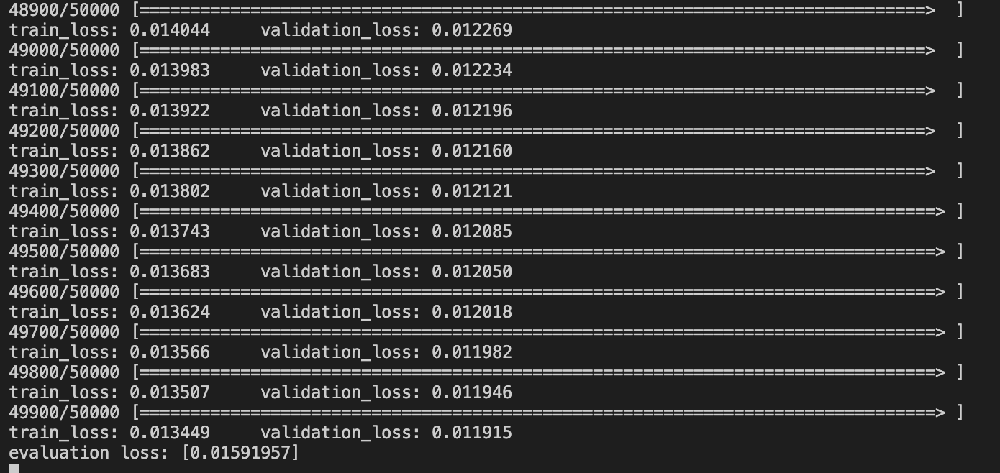
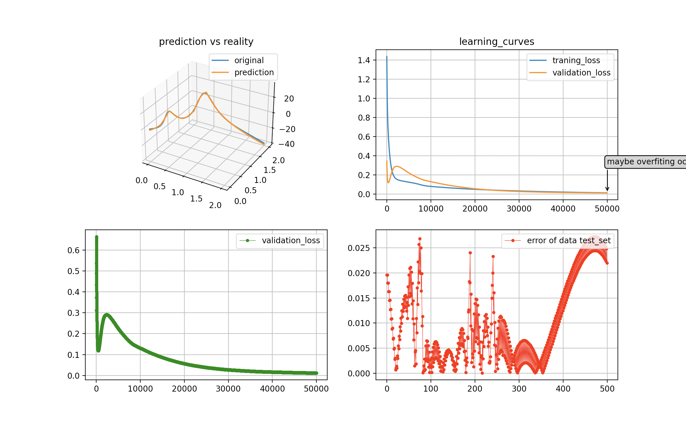

# Neural Network
In this repository, I have implemented the Neural Network using Numpy, Numba packages.

## Using Nerual Network

For using implemented Neural Network your input shape must be `(number_of_features, number_of_inputs)` and then make your desired layer with a specific activation function and then use SGD or BGD Network for training your data.

Supported Activation Functions(activation package):
- sigmoid 
- linear 
- tanh 
- relu

Supported Metrics Functions(metrics package):
- mean squared error(mse)

Supported Optimization Functions:
- momentum 
- SGD
- BDG 
- mini batch gradient decent

Supported Preprocessing Functions:
- MinMaxScaler
- Standard Scalar

## start
In `main.py` file i have made 500 dummy data for predicting humps function.

```bash
    python3 -m venv env
    source env/bin/activate
    (env) pip install -r requirements.txt
    python main.py
```

## screen shots
training on humps function:
- last 1000 epochs of training on Batch Network using 500 data
    
- output after training
    

## todo list
- implementing regularization (l1(lasso), l2(ridge), dropout)
- implementing more loss functions such as binary cross entropy, ... .

